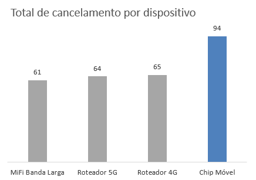
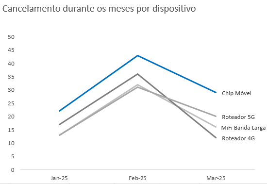
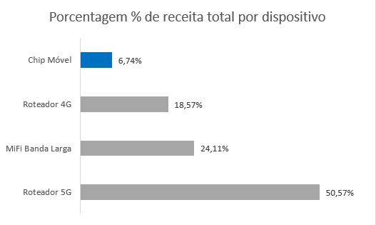
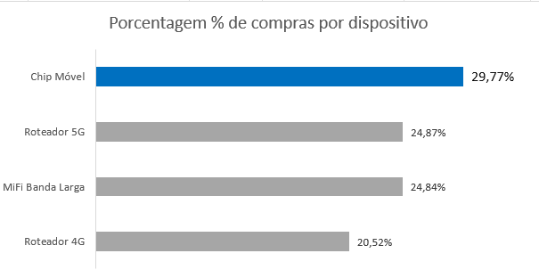
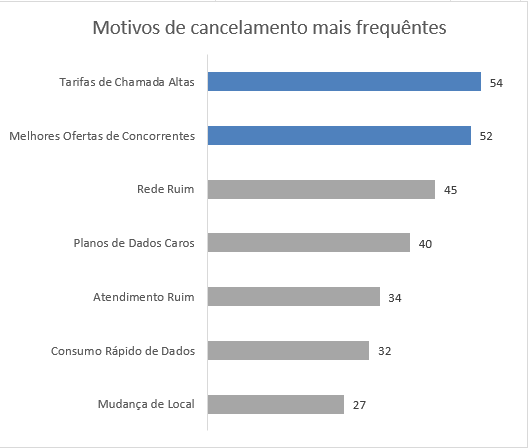
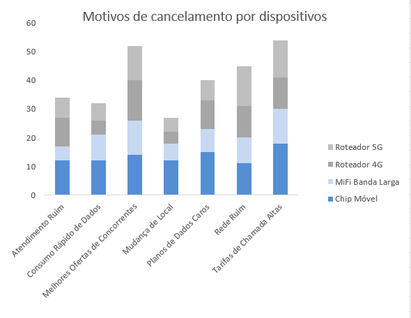

---

# **📊 Análise de Churn — Dispositivos Móveis**

## 🎯 **Contexto do Problema**

O **churn** (cancelamento de clientes) é um dos principais desafios enfrentados pelas empresas de telecomunicações.
Ele representa **a perda de clientes ativos** e indica **insatisfação com o serviço**, seja por preço, qualidade da rede ou concorrência.

O objetivo desta análise é **identificar qual produto tem o maior impacto no churn** e **compreender as principais causas dos cancelamentos**, propondo **ações estratégicas** para reduzir essas perdas.

---

## 🔍 **1. Identificação do Produto com Maior Churn**

Ao analisar o comportamento de cancelamento por tipo de dispositivo, observamos que **os chips móveis se destacam** negativamente.

* Foram **301 chips vendidos**
* Desses, **91 foram cancelados**

Isso resulta em uma **taxa de churn aproximada de 31,1%**, sendo **a mais alta entre todos os produtos**.

Essa descoberta mostra que o **produto mais vendido** é também o **que mais contribui para o aumento da taxa de churn**.

---

## 🕒 **2. Comportamento ao Longo dos Meses**

Analisando a evolução dos cancelamentos ao longo do tempo, é possível perceber que **os chips móveis mantêm altos níveis de churn em praticamente todos os meses**.

Essa constância indica que **o problema é estrutural** — não pontual — e está **ligado à experiência do cliente com o produto.**

---

## 💰 **3. Relação entre Rentabilidade e Churn**

Apesar de representar o **maior volume de vendas**, os chips móveis **contribuem com menos de 10% da rentabilidade total da empresa**.
Isso mostra que o produto tem **baixo retorno financeiro** e **alto custo de manutenção**, já que exige esforço constante para aquisição e reposição de clientes.

|  |  |
|:--:|:--:|
| **% de Receita por Dispositivo** | **% de Compras por Dispositivo** |

---

## 🧩 **4. Principais Motivos de Cancelamento**

Ao analisar os motivos de cancelamento, identificamos três fatores principais que explicam a insatisfação dos clientes:

| Motivo                           | Casos Reportados |
| -------------------------------- | ---------------- |
| Tarifas de chamadas altas        | 54               |
| Melhores ofertas de concorrentes | 52               |
| Rede ruim                        | 45               |

Esses problemas aparecem com frequência entre os usuários de **chips móveis**, reforçando o impacto negativo desse produto na taxa de churn.

## 🔎 **5. Motivos de Cancelamento por Tipo de Dispositivo**

Quando observamos os motivos de cancelamento por dispositivo, os chips móveis novamente aparecem como destaque negativo — concentrando a maioria dos relatos de insatisfação.

Essa sobreposição de fatores — **alto volume de vendas, baixo retorno e alta taxa de cancelamento** — torna o produto **um ponto crítico de atenção para a gestão.**

---

## 🧭 **6. Interpretação dos Resultados**

O cruzamento das informações evidencia que o **chip móvel é o principal gerador de churn da empresa**.

* Clientes de chip móvel são **mais sensíveis a preço e qualidade**,
* As **tarifas elevadas e planos caros** aumentam o risco de cancelamento,
* A **concorrência oferece alternativas mais vantajosas**,
* E a **qualidade de rede** é frequentemente apontada como um fator de insatisfação.

Em resumo: o produto tem **grande adesão**, mas **baixa fidelização e baixo retorno**.

---

## 💡 **7. Recomendações Estratégicas**

Com base nos resultados, seguem **ações recomendadas** para reduzir o churn e melhorar a satisfação do cliente no segmento de chips móveis:

### 🔧 **1. Revisão das Tarifas de Chamadas**

* Ajustar tarifas para torná-las mais competitivas.
* Criar planos simplificados e transparentes, reduzindo a sensação de custo elevado.

### 📱 **2. Reformulação dos Planos de Dados**

* Oferecer **planos flexíveis** que permitam ao cliente ajustar o pacote conforme o uso.
* Criar **benefícios de fidelização**, como bônus ou descontos progressivos.

### 📶 **3. Melhoria da Qualidade da Rede**

* Mapear as regiões com maior número de reclamações e investir em melhorias locais
* Garantir **estabilidade de conexão**, principalmente em áreas urbanas densas.

### 💬 **4. Estratégia de Retenção Proativa**

* Criar alertas para **clientes com alto risco de churn**, oferecendo **benefícios personalizados** antes do cancelamento.
* Implantar **pesquisas rápidas de satisfação** pós-venda para antecipar problemas.

---

## 🧾 **Conclusão**

A análise mostrou que os **chips móveis** são o **principal foco de churn** na empresa.
Embora sejam os **mais vendidos**, também são os que **mais geram cancelamentos** e **menos rentabilidade trazem**.

> Reduzir o churn nesse produto é essencial para **melhorar a rentabilidade, aumentar a fidelização e fortalecer a imagem da marca** no mercado.

